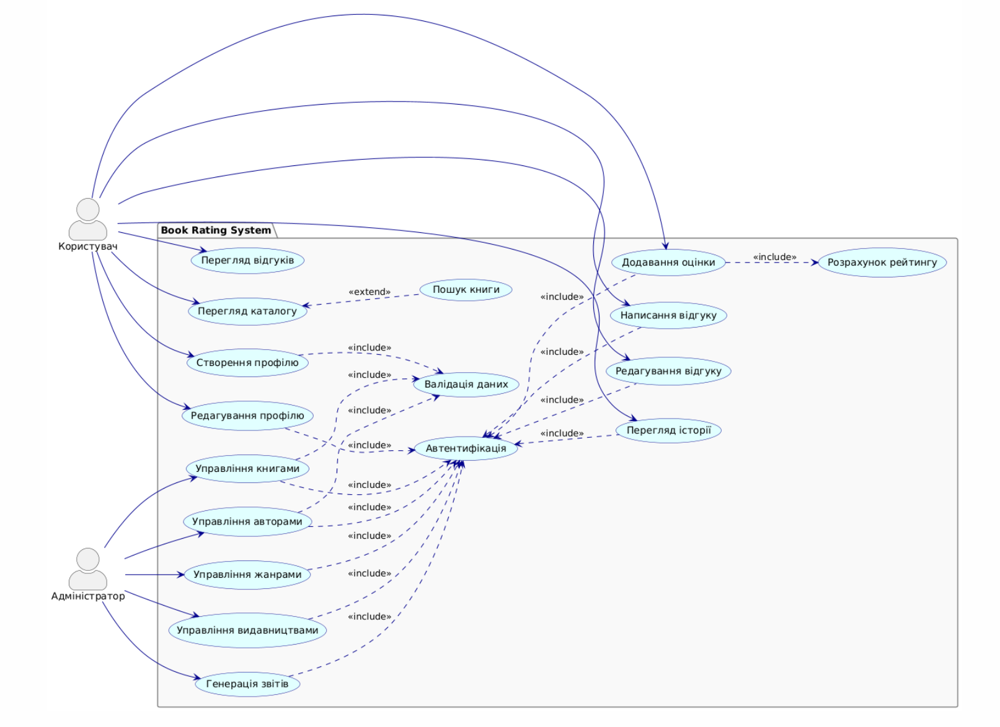

```
@startuml
skinparam actorStyle awesome
skinparam useCase {
    BackgroundColor #LightCyan
    BorderColor #DarkBlue
    ArrowColor #DarkBlue
    ActorBorderColor #DarkSlateGray
}
skinparam package {
    BackgroundColor #F8F8F8
    BorderColor #Gray
}

left to right direction

actor "Користувач" as User
actor "Адміністратор" as Admin

package "Book Rating System" {
    usecase "Перегляд каталогу" as UC_Catalog
    usecase "Пошук книги" as UC_Search
    usecase "Створення профілю" as UC_CreateProfile
    usecase "Редагування профілю" as UC_EditProfile
    usecase "Додавання оцінки" as UC_AddRating
    usecase "Написання відгуку" as UC_WriteReview
    usecase "Редагування відгуку" as UC_EditReview
    usecase "Перегляд відгуків" as UC_ViewReviews
    usecase "Перегляд історії" as UC_ViewHistory

    usecase "Управління книгами" as UC_ManageBooks
    usecase "Управління авторами" as UC_ManageAuthors
    usecase "Управління жанрами" as UC_ManageGenres
    usecase "Управління видавництвами" as UC_ManagePublishers
    usecase "Генерація звітів" as UC_Reports

    usecase "Автентифікація" as UC_Auth
    usecase "Валідація даних" as UC_Validate
    usecase "Розрахунок рейтингу" as UC_CalcRating

    UC_Auth -[hidden]right-> UC_Validate
}

User --> UC_Catalog
User --> UC_CreateProfile
User --> UC_EditProfile
User --> UC_AddRating
User --> UC_WriteReview
User --> UC_EditReview
User --> UC_ViewReviews
User --> UC_ViewHistory

Admin --> UC_ManageBooks
Admin --> UC_ManageAuthors
Admin --> UC_ManageGenres
Admin --> UC_ManagePublishers
Admin --> UC_Reports

UC_CreateProfile .down.> UC_Validate : <<include>>
UC_EditProfile .down.> UC_Auth : <<include>>
UC_AddRating .up.> UC_Auth : <<include>>
UC_WriteReview .up.> UC_Auth : <<include>>
UC_EditReview .up.> UC_Auth : <<include>>
UC_ViewHistory .up.> UC_Auth : <<include>>

UC_ManageBooks .down.> UC_Auth : <<include>>
UC_ManageAuthors .down.> UC_Auth : <<include>>
UC_ManageGenres .down.> UC_Auth : <<include>>
UC_ManagePublishers .down.> UC_Auth : <<include>>
UC_Reports .down.> UC_Auth : <<include>>

UC_ManageBooks .down.> UC_Validate : <<include>>
UC_ManageAuthors .down.> UC_Validate : <<include>>

UC_AddRating .down.> UC_CalcRating : <<include>>

UC_Catalog <.. UC_Search : <<extend>>
@enduml
```

[Переглянути діаграму в PlantUML](https://www.plantuml.com/plantuml/uml/ZLRHJXDD5BxVfvZqlwRNVmmXbAfueGcXKI-CCMDtQ2VTxZIpizR6c208UYL4JKrCZ1fVW9GYjT3o2hDlv9nPbZrCArj82hldVD-SyvtlJBeQAIfLt0wygCN33fMqJMXT2LbJlO0HscMHQ3CKZ2DMfH4ZhpnYVjPelTMG8WxzgWY49F_TvuscglPec8Q5z9cy3DscihKMnCn6AbAAxjm073w3gmLKiNL9UzvhL4l7d4uR_wpbxl_mErl89OyNi2r5b20IQYO-bwokk0Wzpmf0IlghdYRRUfIyINQINJtGHycx4g4HUHWnUPLqg8VwFEdhITAtYTicRGU0DhNYjxbXp2ejhGdH8fjKyR11Qhr8iNOfBH-4hOEm9VrTdnYM4tsipv83FIHwR2cFz9cUwkDaDwsX-gnA5Gr4mqMRiz-RSiU0c-YHeHbbY1gZijvq03yDzy20uCY9QUE0w0lpC4tU9drJmOUhuoIZYcr8iSK3vd3yCDYXgV0urUb6dZi-L_DPFkifi206Wzu7RVKuRwBY-wc03lgRGLt0j7Bqm627jgXnBjjZoHNRP2yuwoxKXSE2kaX9YgQ7uNqzo0WU6MXA41KmfCQ22Pd_lc3yFHuf8NiMxv3y0l51IqFIpph9376aptCz7z3GM1EC6It00OzfCVDOAh5g2haGpsyGU3xBEWibMuJ4F8nInq1ZoJuuUHxXHlmyu56JpLJsoNh-18Z1Q41v2WDBTl2eDbb7I1NDa_aGr00IypcoJXzdL1aQD75G7s6PmHRviT05zB1tDLyQS9-gsKsRwbDRxvvnrCGyZObron-eG4-kNn117QqAV6G5aQKdJUxxB7ngRx-b5NmaN8vmnv4bynvTDEYTSnlW26o6-nxlBU9njj5bSLyxMuFVustmxAKB4SVUAE0u5eTS6-A8woSKnKRnN858sHVTi7nDPNABB2_pi1x4FbjPyP1o3W1AT9EHdAGSTsvAH0eNf2BHYpAHtZUcUjSdKDmMdafnEfvKSROxlM94Db4tiRXBTzf5dHP3dA5d-NZDNKI-ksIvNCw_0TWyzbAnq8UqLVCtRWT_0G00)


