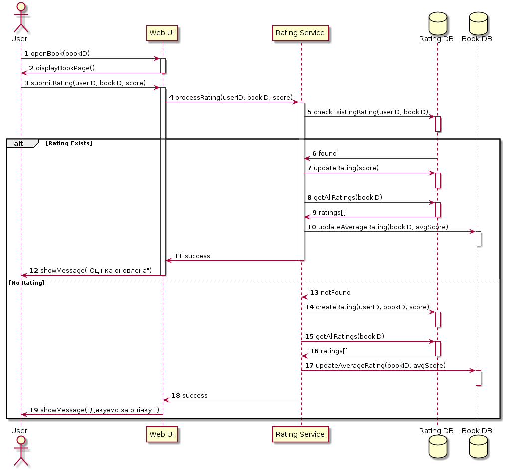

```
@startuml
autonumber

actor User
participant "Web UI" as UI
participant "Rating Service" as RS
database "Rating DB" as RDB
database "Book DB" as BDB

User -> UI: openBook(bookID)
activate UI
UI -> User: displayBookPage()
deactivate UI

User -> UI: submitRating(userID, bookID, score)
activate UI
UI -> RS: processRating(userID, bookID, score)
activate RS
RS -> RDB: checkExistingRating(userID, bookID)
activate RDB
deactivate RDB

alt Rating Exists
    RDB -> RS: found
    RS -> RDB: updateRating(score)
    activate RDB
    deactivate RDB
    RS -> RDB: getAllRatings(bookID)
    activate RDB
    RDB -> RS: ratings[]
    deactivate RDB
    RS -> BDB: updateAverageRating(bookID, avgScore)
    activate BDB
    deactivate BDB
    RS -> UI: success
    deactivate RS
    UI -> User: showMessage("Оцінка оновлена")
    deactivate UI
else No Rating
    RDB -> RS: notFound
    RS -> RDB: createRating(userID, bookID, score)
    activate RDB
    deactivate RDB
    RS -> RDB: getAllRatings(bookID)
    activate RDB
    RDB -> RS: ratings[]
    deactivate RDB
    RS -> BDB: updateAverageRating(bookID, avgScore)
    activate BDB
    deactivate BDB
    RS -> UI: success
    deactivate RS
    UI -> User: showMessage("Дякуємо за оцінку!")
    deactivate UI
end

@enduml
```


