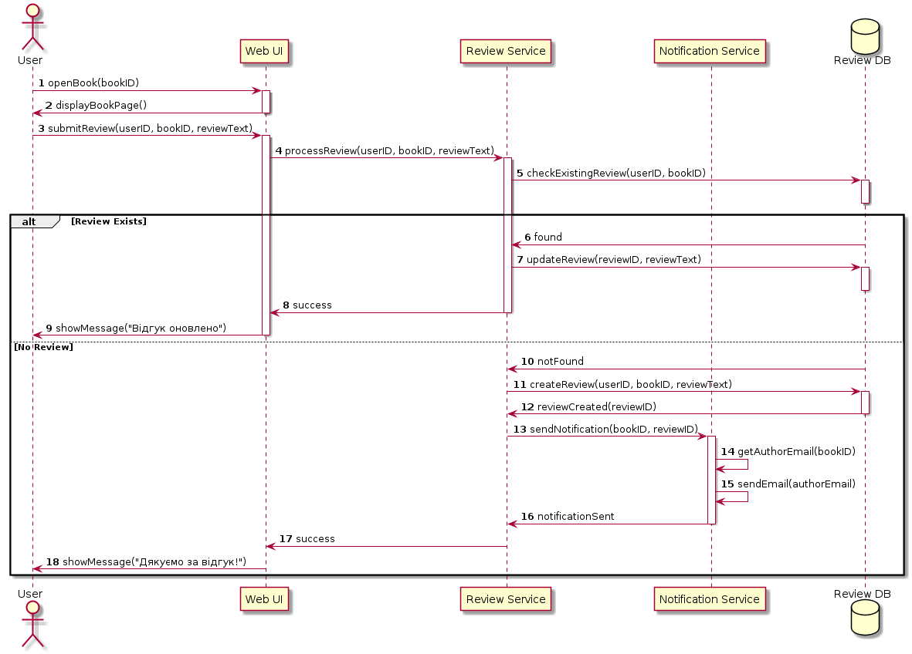

```
@startuml
autonumber

actor User
participant "Web UI" as UI
participant "Review Service" as RevS
participant "Notification Service" as NS
database "Review DB" as RevDB

User -> UI: openBook(bookID)
activate UI
UI -> User: displayBookPage()
deactivate UI

User -> UI: submitReview(userID, bookID, reviewText)
activate UI
UI -> RevS: processReview(userID, bookID, reviewText)
activate RevS
RevS -> RevDB: checkExistingReview(userID, bookID)
activate RevDB
deactivate RevDB

alt Review Exists
    RevDB -> RevS: found
    RevS -> RevDB: updateReview(reviewID, reviewText)
    activate RevDB
    deactivate RevDB
    RevS -> UI: success
    deactivate RevS
    UI -> User: showMessage("Відгук оновлено")
    deactivate UI
else No Review
    RevDB -> RevS: notFound
    RevS -> RevDB: createReview(userID, bookID, reviewText)
    activate RevDB
    RevDB -> RevS: reviewCreated(reviewID)
    deactivate RevDB
    RevS -> NS: sendNotification(bookID, reviewID)
    activate NS
    NS -> NS: getAuthorEmail(bookID)
    NS -> NS: sendEmail(authorEmail)
    NS -> RevS: notificationSent
    deactivate NS
    RevS -> UI: success
    deactivate RevS
    UI -> User: showMessage("Дякуємо за відгук!")
    deactivate UI
end

@enduml
```


