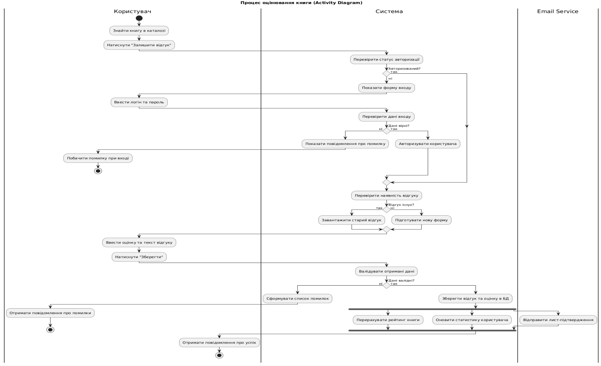

```
@startuml
title Процес оцінювання книги (Activity Diagram)
skinparam conditionStyle diamond
skinparam defaultTextAlignment center

|Користувач|
|Система|
|Email Service|

|Користувач|
start
:Знайти книгу в каталозі;
:Натиснути "Залишити відгук";

|Система|
:Перевірити статус авторизації;

if (Авторизований?) then (ні)
  :Показати форму входу;

  |Користувач|
  :Ввести логін та пароль;

  |Система|
  :Перевірити дані входу;

  if (Дані вірні?) then (ні)
    :Показати повідомлення про помилку;

    |Користувач|
    :Побачити помилку при вході;
    stop
  else (так)
   |Система|
    :Авторизувати користувача;
  endif
else (так)
endif

|Система|
:Перевірити наявність відгуку;

if (Відгук існує?) then (так)
  :Завантажити старий відгук;
else (ні)
  :Підготувати нову форму;
endif

|Користувач|
:Ввести оцінку та текст відгуку;
:Натиснути "Зберегти";

|Система|
:Валідувати отримані дані;

if (Дані валідні?) then (ні)
  :Сформувати список помилок;

  |Користувач|
  :Отримати повідомлення про помилки;
  stop
else (так)
  |Система|
  :Зберегти відгук та оцінку в БД;

  fork
    :Перерахувати рейтинг книги;
  fork again
    :Оновити статистику користувача;
  fork again
    |Email Service|
    :Відправити лист-підтвердження;
    |Система|
  end fork

  |Користувач|
  :Отримати повідомлення про успіх;
  stop
endif

@enduml
```


