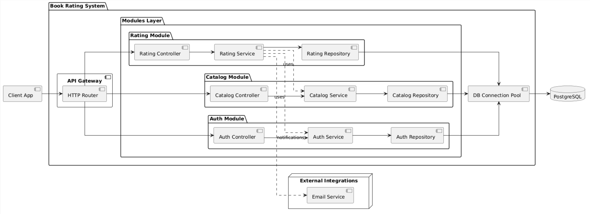

```
@startuml Book Rating System

skinparam componentStyle uml2
skinparam linetype ortho
skinparam backgroundcolor white
left to right direction

component "Client App" as Client

package "Book Rating System" {

    component "API Gateway" as Gateway {
        component "HTTP Router" as Http
    }

    package "Modules Layer" {

        package "Auth Module" {
            component "Auth Controller" as AuthC
            component "Auth Service" as AuthS
            component "Auth Repository" as AuthR

            AuthC --> AuthS
            AuthS --> AuthR
        }

        package "Catalog Module" {
            component "Catalog Controller" as CatC
            component "Catalog Service" as CatS
            component "Catalog Repository" as CatR

            CatC --> CatS
            CatS --> CatR
        }

        package "Rating Module" {
            component "Rating Controller" as RatC
            component "Rating Service" as RatS
            component "Rating Repository" as RatR

            RatC --> RatS
            RatS --> RatR
        }
    }

    component "DB Connection Pool" as Pool

}

database "PostgreSQL" as DB

node "External Integrations" {
    component "Email Service" as Email
}

Client --> Http

Http --> AuthC
Http --> CatC
Http --> RatC

RatS ..> AuthS : uses
RatS ..> CatS : uses

RatS ..> Email : "notifications"

AuthR --> Pool
CatR --> Pool
RatR --> Pool

Pool --> DB

@enduml
```


